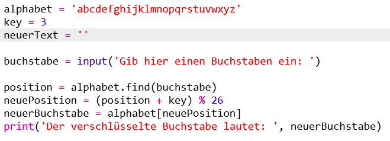
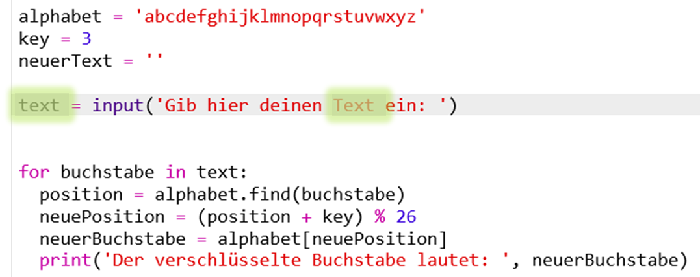
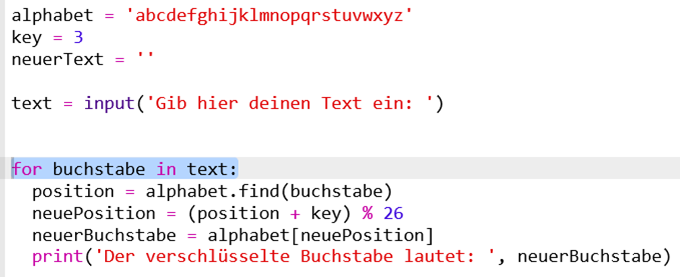
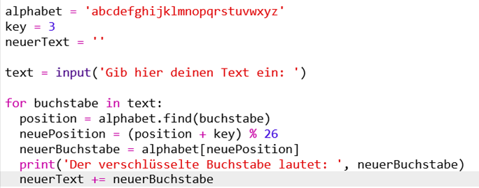

## Komplette Mitteilungen verschlüsseln

Anstatt die Nachrichten mit nur je einem Zeichen einzeln zu verschlüsseln, bzw. zu entschlüsseln, lass uns jetzt das Programm ändern, um komplette Mitteilungen zu verschlüsseln!

+ Prüfe als Erstes, ob dein Code so aussieht:

	

+ Erstelle eine Variable, um die neue, verschlüsselte Mitteilung zu speichern.

	

+ Ändere deinen Code, damit du die Mitteilung des Nutzers und nicht bloß nur ein Zeichen speichern kannst.

	

+ Füge eine `for` (für) Schleife zu deinem Code hinzu und rücke den Rest des Codes ein, damit er für jedes Zeichen in der Mitteilung wiederholt wird.

	

+ Teste deinen Code. Du solltest sehen können, dass jedes Zeichen in der Mitteilung verschlüsselt ist und je einzeln ausgedruckt wird.

	

+ Lass uns jedes der verschlüsselten Zeichen deiner `newMessage` (neue Mitteilung) Variable hinzufügen.

	

+ Du kannst die `newMessage` (neue Mitteilung) `print` (drucken), während  sie verschlüsselt wird.

	

+ Wenn du die Leerzeichen vor dem `print` (drucken) Statement löschst, wird die verschlüsselte Mitteilung nur einmal am Ende angezeigt. Du kannst auch den Code zum Drucken der Zeichen Positionierungsnummern löschen.

	
