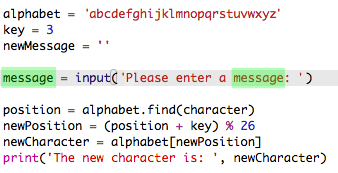

## Chiffre des messages en entier

Au lieu de simplement chiffrer et déchiffrer des messages une lettre à la fois, changeons le programme pour chiffrer des messages en entier !

+ D'abord, vérifie que ton code ressemble à ce qui suit :

	

+ Créer une variable pour stocker le nouveau message chiffré.

	

+ Change ton code pour stocker le message de l'utilisateur et pas uniquement un seul caractère.

	

+ Ajoute une boucle `for` à ton code, et décale le reste du code pour que ça soit répèté pour chaque caractère dans le message.

	

+ Teste ton code. Tu devrais voir que chaque caractère dans le message sera chiffré et imprimé à l'écran l'un après l'autre.

	

+ Ajoutons chaque caractère chiffré dans la variable `newMessage`.

	

+ Tu peux afficher (`print`) la variable `newMessage` en cours de chiffrement.

	

+ Si tu supprimes les espaces avant la déclaration `print`, le message crypté ne sera affiché qu'une fois à la fin. Tu pourrais également supprimer le code pour afficher les positions des caractères.

	
