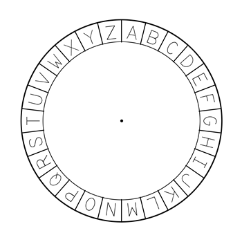
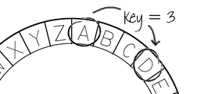

## A cifra de César

Uma cifra é um tipo de código secreto, onde você troca as letras para que ninguém possa ler sua mensagem.

Você estará usando uma das mais antigas e famosas cifras, a **César cifra**, que leva o nome de Júlio César.

Antes de começarmos a codificar, vamos tentar usar a cifra de César para esconder uma palavra.

+ Ocultar uma palavra é chamado de **criptografia**.
    
    Vamos começar criptografando a letra 'a'. Para fazer isso, podemos desenhar o alfabeto em um círculo, assim:
    
    

+ Para criar uma carta criptografada secreta de uma carta normal, você precisa ter uma chave secreta. Vamos usar o número 3 como chave (mas você pode usar qualquer número que quiser).
    
    Para **criptografar** a letra 'a', você apenas move 3 letras no sentido horário, o que lhe dará a letra 'd':
    
    

+ Você pode usar o que aprendeu para criptografar uma palavra inteira. Por exemplo, 'olá' criptografado é 'khoor'. Tente você mesmo.
    
    + h + 3 = **k**
    + e + 3 = **h**
    + l + 3 = **o**
    + l + 3 = **o**
    + o + 3 = **r**

+ Retornar o texto ao normal é chamado de **decriptografia**. Para descriptografar uma palavra, basta subtrair a chave em vez de adicioná-la:
    
    + k - 3 = **h**
    + h - 3 = **e**
    + o - 3 = **l**
    + o - 3 = **l**
    + r - 3 = **o**